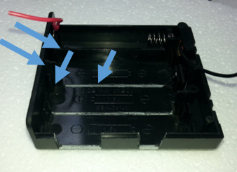

# Lithium Battery USB Charger - Powering your Arduino Project

So you’ve just finished building your Arduino project, and  it’s happily running off the USB lead hanging out of your computer. And if it  something like the [Arduino  Clock](https://jaycar.com.au/diy-arduino-clock) that looks at home on a desk, then everything is fine. But if it’s  something you want to use away from a computer like the [Secret Knock Detector](https://jaycar.com.au/diy-secret-knock-detector) ,  or even outside where there’s not even a power point (like the [Breathalyser](https://jaycar.com.au/diy-arduino-breathalyser)),  then there’s a number of options. Towards the end of this article, I’ll  describe a brief project to give you a flexible power supply system.  

## Overview

The [Uno](https://jaycar.com.au/p/XC4410) board (and the [Mega](https://jaycar.com.au/p/XC4420) and [Leonardo](https://jaycar.com.au/p/XC4430)), actually have four  different ways that power can be connected. All the following except the DC  socket also apply to the [Nano](https://jaycar.com.au/p/XC4414). These are:

## Components

|Qty| Code | Description |
|---|---|---|
|1 | [XC4502](http://jaycar.com.au/p/XC4502) | Lithum battery USB charger module
|1 | [SB2300](http://jaycar.com.au/p/SB2300) | 14500 Lithium battery
|1 | [XC4512](http://jaycar.com.au/p/XC4512) | DC to 5V DC Converter
|1 | [RR0600](http://jaycar.com.au/p/RR0600) | 15k 0.5W resitor
|1 | [PH9282](http://jaycar.com.au/p/PH9282) | 4AA switched battery holder

## USB Socket

It’s what we’ve been using so far, but we can even use the  USB socket without a computer. For example, if you have a spare [USB phone charger](https://jaycar.com.au/p/MP3449) , you could use  that with your USB lead. If you want to take your project outside, you could  even use a [portable battery bank](https://jaycar.com.au/p/MB3717) .

These are all still fairly temporary solutions, but handy if  you want to take your project away from your computer during the testing stage.

## DC Socket

The DC socket allows a non-regulated power supply to be used  on the Arduino main board, as an input here is fed through a 5V regulator  before it gets to the main IC. The socket takes a 2.1mm plug with a positive  centre and the regulator needs at least 7 volts to be able to work properly,  but more isn’t necessarily better, as the higher the voltage, the hotter the  regulator will get. Twelve volts is the recommended maximum, so if you have a

A quick and easy portable power supply that  doesn’t need any soldering can be made from a[9V](https://jaycar.com.au/p/MP3484) or[12V](https://jaycar.com.au/p/MP3486) DC plug pack around, you could  use that. It’s even feasible to use something like a [car cigarette lead](https://jaycar.com.au/p/PP1996) to run your  Arduino in a car (just remember to use the 2.1mm plug end and set the plug for a positive centre) [screw terminal DC plug](https://jaycar.com.au/p/PA3711) and a[9V battery snap](https://jaycar.com.au/p/PH9232) . Just make sure  the red wire goes to the + terminal!

A quick and easy  portable Arduino power supply with [9V battery](https://jaycar.com.au/p/SB2417)

## VIN Pin

An alternative to the DC Socket is the VIN pin- they are  practically the same as far as input requirements are concerned, except that  the VIN pin doesn’t have a reverse polarity diode like the DC socket does. All  that means is that you need to make doubly sure that what you’re plugging into  VIN is right, or you might fry your board. You will of course need to connect  the negative leg of your supply to one of the GND pins on the board too.  There’s two next two VIN and another one on the other side between D13 and  AREF. Using VIN might be an easy way to feed power in through a custom shield,  for example using a [PCB mount 9V  battery clip](https://jaycar.com.au/p/PH9235) on a [Prototyping  shield.](https://jaycar.com.au/p/XC4480)

## 5V Pin

If you have a 5V supply, you could even feed that straight  into the 5V pin on the Arduino board instead of the VIN pin. The same  precautions that apply to VIN apply here, as the 5V pin connects directly to  main processor IC on the Arduino board. A common use for the 5V input is when  you are using a module that has a built in 5V regulator, like a [Stepper Motor Driver Module](https://jaycar.com.au/p/XC4492) ,  especially because the 5V regulator on such a module might be better than the  one on the Arduino board. Of course, like with VIN, you need to connect the  negative of your supply to the GND pin.

And just because the pin is labelled 5V, doesn’t mean it has  to be exactly 5V. Even the USB standard for 5V allows between 4.5V and 5.5V and  the AtMega328 IC on the Uno can handle up to 5.5V, and is specified to work  down to 3.8V when used with the 16MHz crystal on the Uno board (some people  have even reported that it works fine down to 2.7V!) This could be supplied by  3xAA batteries. Why not use a [4xAA  switched battery holder](https://jaycar.com.au/p/PH9282) for your next Nano project, and the Nano can sit in  one of the battery spots? If you’re using rechargeable NiMH batteries, you  could use four of them, as they max out at about 1.3V each, so that you don’t  go over the 5.5V limit.

Another power source close to 5V is rechargeable Lithium Ion  Batteries. Although they say they are 3.7V, this is usually when they’re close  to flat. An easy way to do this would be a [14500 size Li-Ion battery](https://jaycar.com.au/p/SB2300) in a[AA battery holder](https://jaycar.com.au/p/PH9203) (the 14500 is  actually the same size as a AA battery). See the project below for how this is  done.  

## Precautions

Generally, you can’t hook up more than one of these power  supplies at a time. For example, if you find you need to reprogram the board,  make sure any other power supplies are disconnected or turned off before  hooking up the USB.

## A Portable Power Solution

If you want a compact power solution, especially one that  needs to fit into a case, then there are a few modules you can connect to a  rechargeable battery to provide charging and even a regulated 5V output supply  (this is similar to what’s in the rechargeable battery banks).

There is some soldering, cutting and gluing involved, but  it shouldn’t take long to put together. Firstly, open up the battery holder and  remove most of the battery springs, then move the positive battery tab to the  leftmost battery slot.

Then cut battery dividers and slots for the USB modules.  If the modules are a good press-fit, then you’ll need less glue later.

Unsolder the 1.2k resistor from the Battery Charger  Module. By default, this sets the charge current to 1A, but the battery we are  using is ideally charged at 80mA, so we are using a 15k resistor instead.

The hardest part is to replace the old resistor with the  15k resistor. Note that the resistor goes between pin 2 of the IC and ground,  so we can use the larger ground pad near the USB socket.

Trim the component legs on the underside of the DC  converter modules so that they are flush. Doing this will save having to trim  the lid of the battery holder.

After this, solder the wires from the battery tabs to the  modules. All the positive leads can be connected together, because the switch  on the battery holder switches the negative lead. The negative lead from the  switch should go to the DC converter module so that the output can be switched  off. The negative lead from the Charge Module can be soldered directly to the  battery spring (I’ve attached it to the metal tab that leads to the switch).  You shouldn’t need any extra wire if you use the spare leads from the battery  holder.

Note how I’ve pushed the DC converter module to the right  slightly so that it’s poking out of the case. That leaves a bit more room  inside the battery holder for either a second battery or even a Nano!

Make sure the lid fits on, then glue the modules down. I  used [Super-Glue](https://jaycar.com.au/p/NA1500) , but[Epoxy](https://jaycar.com.au/p/NA1510) would work as well. After  the glue is set, insert the battery. If you turn the switch on, the light on  the DC Converter should light. If you plug a USB lead into the Charge Module  should light up red (or blue if the battery is fully charged). You can charge  and use the output at the same time because the two modules are completely  independent. Keep in mind that we’re only charging at 80mA, and that the DC  Converter module can only output 500mA, so it’s not going to be much good for  charging a mobile phone. If you are using more than 80mA out of the DC  Converter, even while charging, the battery will be discharging.

## What's Next?

As I mentioned above, most Arduino boards will happily run  straight off a Lithium battery, so you could even ditch the DC converter module  and run the power from the switch straight to the Arduino board- a Nano will  fit in the battery holder if its ISP pins are removed (these are the ones that  poke up on the top of the board. It’ll be even smaller if the header pins are  all removed.

There’s also just enough room to fit a second battery-  here’s where you can use the spare battery springs that you removed earlier.  Just remember to connect all the batteries is parallel- ie positive to positive  and negative to negative. You’ll have less space available, but longer running  times.
